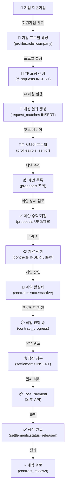

# 데이터 흐름 (Data Flow)

## 핵심 비즈니스 흐름: TF 요청 → 계약 → 정산



---

## 1. 인증 흐름 (Authentication Flow)

### 1.1 회원가입 순서도

```
사용자 접속 (/signup)
    ↓
회원가입 폼 표시
├─ Email 입력
├─ Password 입력
└─ Role 선택 (company / senior)
    ↓
signup() Server Action
    │
    ├─[1] 입력 검증
    │   └─ Email 형식, Password 강도, Role 유효성
    │
    ├─[2] Supabase Auth signUp()
    │   └─ auth.users 행 생성
    │
    ├─[3] on_auth_user_created 트리거 (자동)
    │   └─ profiles (id, role, full_name, created_at) 행 생성
    │
    ├─[4] 성공 시 /login으로 리다이렉트
    │
    └─[5] 실패 시 에러 메시지 표시
```

**데이터 변경**

| 테이블 | 동작 | 컬럼 | 값 |
|--------|------|------|-----|
| auth.users | INSERT | id, email, encrypted_password, email_confirmed_at | — |
| profiles | INSERT (트리거) | id, role, full_name, created_at, updated_at | user_id, 'company'/'senior', NULL, now() |

**RLS 정책**: 프로필은 자신의 행만 조회 가능

### 1.2 로그인 순서도

```
사용자 접속 (/login)
    ↓
로그인 폼 표시
├─ Email 입력
└─ Password 입력
    ↓
login() Server Action
    │
    ├─[1] Supabase Auth signInWithPassword()
    │   ├─ auth.users 테이블 조회
    │   └─ 비밀번호 검증
    │
    ├─[2] 성공 시 세션 쿠키 설정
    │   └─ secure, httpOnly
    │
    ├─[3] returnUrl 파라미터로 리다이렉트
    │   └─ 기본값: /dashboard
    │
    └─[4] 실패 시 에러 메시지
```

**후속 동작**
- middleware.ts가 모든 요청에서 updateSession() 실행
- 세션 쿠키에서 auth.uid() 추출
- 미들웨어 다음 단계에서 구성 요소가 auth.uid() 사용

### 1.3 인가 검증 (Authorization Validation)

```
모든 보호 경로 요청
    ↓
middleware.ts
├─ isProtectedPath() 확인
└─ user 없으면 /login 리다이렉트
    ↓
(dashboard)/layout.tsx 또는 (senior)/layout.tsx
├─ await supabase.auth.getUser()
│   └─ 현재 사용자 ID
├─ await supabase
│   .from('profiles')
│   .select('role')
│   .eq('id', user.id)
│   .maybeSingle()
│   └─ RLS 자동 필터링 (자신 프로필만)
├─ role 검증
│   ├─ (dashboard) 접근 → role === 'company' 확인
│   └─ (senior) 접근 → role === 'senior' 확인
└─ 불일치 시 리다이렉트
```

**3계층 보안**
1. **미들웨어**: 미인증 사용자 차단
2. **레이아웃**: 역할 검증
3. **RLS**: 데이터베이스 행 단위 필터링

---

## 2. TF 요청 → 제안 흐름 (Request & Proposal Flow)

### 2.1 기업의 TF 요청 생성

```
기업 사용자: /dashboard/requests/new 방문
    ↓
TfRequestForm (Client Component) 렌더링
├─ 제목 입력
├─ 분야 선택 (field)
├─ 기간 선택 (duration_weeks: 1~104)
├─ 예산 입력 (budget_min, budget_max)
├─ 목표 설명 (goals)
└─ 지역 선택 (region)
    ↓
폼 제출 → createTfRequest() Server Action
    │
    ├─[1] 폼 데이터 파싱
    │   └─ FormData 객체 → 필드 추출
    │
    ├─[2] 데이터 검증
    │   ├─ title: 필수, 최대 길이
    │   ├─ duration_weeks: 1 ~ 104
    │   ├─ budget_min <= budget_max
    │   └─ goals: 필수
    │
    ├─[3] 기업 ID 결정
    │   └─ await supabase
    │       .from('companies')
    │       .select('id')
    │       .eq('owner_id', user.id)
    │       .maybeSingle()
    │       └─ RLS 자동 필터링
    │
    ├─[4] tf_requests INSERT
    │   ├─ INSERT INTO tf_requests (
    │   │   company_id,
    │   │   title,
    │   │   field,
    │   │   duration_weeks,
    │   │   budget_min,
    │   │   budget_max,
    │   │   goals,
    │   │   region,
    │   │   status,  ← 'open'
    │   │   created_at
    │   │ )
    │   └─ RLS: 자신의 company_id만 INSERT 가능
    │
    ├─[5] 캐시 갱신
    │   └─ revalidatePath('/dashboard/requests')
    │
    ├─[6] /dashboard/requests/[newId] 리다이렉트
    │
    └─[7] 외부: AI 매칭 엔진 트리거 (비동기)
        └─ TF 요청과 시니어 프로필 매칭
```

**데이터 변경**

| 테이블 | 동작 | 설명 |
|--------|------|------|
| tf_requests | INSERT | 새 TF 요청 행 생성 (status='open') |

**RLS 정책**
```sql
-- tf_requests_select_own
SELECT: company_id IN (
  SELECT id FROM companies 
  WHERE owner_id = auth.uid()
)

-- tf_requests_insert_own
INSERT: company_id IN (
  SELECT id FROM companies 
  WHERE owner_id = auth.uid()
)
```

### 2.2 AI 매칭 엔진 (외부 시스템)

```
TF 요청 생성 직후
    ↓
외부 매칭 서비스 트리거
    │
    ├─ 요청 내용 분석
    │   ├─ field (분야)
    │   ├─ duration_weeks (기간)
    │   ├─ budget_min/max (예산)
    │   └─ region (지역)
    │
    ├─ 시니어 프로필 검색
    │   ├─ senior_profiles 테이블 스캔
    │   ├─ 스킬 매칭
    │   └─ 지역 매칭
    │
    ├─ 점수 산정 (match_score: 0~100)
    │   └─ 분야, 기간, 지역, 경험 가중치 계산
    │
    └─ request_matches INSERT
        └─ request_id, senior_id, match_score, created_at
```

**데이터 변경**

| 테이블 | 동작 | 설명 |
|--------|------|------|
| request_matches | INSERT | 일치하는 시니어별 매칭 행 생성 |

**외부 시스템 계약**
- Service role key 사용 (또는 내부 인증)
- RLS 우회 가능
- 동기화 보장 (트리거 또는 웹훅)

### 2.3 시니어의 제안 수신 및 검토

```
시니어 사용자: /senior/proposals 방문
    ↓
proposals 조회 (Server Component)
├─ SELECT * FROM proposals
│  WHERE senior_id = auth.uid()
│  └─ RLS: 자신의 제안만
│
├─ 관련 데이터 JOIN
│  ├─ tf_requests (요청 상세)
│  ├─ companies (기업 정보)
│  └─ request_matches (매칭 점수)
│
└─ ProposalList 렌더링
    ├─ 요청 제목
    ├─ 기간 / 예산
    ├─ 매칭 점수
    └─ [상세 보기] 링크
        ↓
    시니어가 [상세 보기] 클릭
        ↓
    /senior/proposals/[proposalId] 방문
        ↓
    제안 상세 페이지
    ├─ 요청 전문
    ├─ 기업 정보
    ├─ 매칭 이유
    └─ [수락] 또는 [거절] 버튼
```

**데이터 읽기 (RLS 적용)**

```sql
-- proposals 조회
SELECT 
  p.*,
  r.title, r.field, r.duration_weeks, r.budget_min, r.budget_max,
  c.name as company_name,
  m.match_score
FROM proposals p
LEFT JOIN tf_requests r ON p.tf_request_id = r.id
LEFT JOIN companies c ON r.company_id = c.id
LEFT JOIN request_matches m ON 
  m.request_id = r.id AND 
  m.senior_id = p.senior_id
WHERE p.senior_id = auth.uid()
```

### 2.4 시니어의 제안 수락

```
시니어가 /senior/proposals/[proposalId]에서 [수락] 클릭
    ↓
acceptProposal(proposalId) Server Action
    │
    ├─[1] 권한 검증
    │   └─ proposals 테이블에서 조회 후 senior_id 확인
    │
    ├─[2] 제안 상태 업데이트
    │   ├─ UPDATE proposals
    │   │  SET status = 'accepted',
    │   │      updated_at = now()
    │   │  WHERE id = proposalId
    │   │  AND senior_id = auth.uid()  ← RLS 자동 확인
    │   └─ RLS 정책: 자신의 제안만 업데이트 가능
    │
    ├─[3] 계약 생성 (자동)
    │   └─ INSERT INTO contracts (
    │       proposal_id,
    │       company_id,  ← tf_requests.company_id로부터
    │       senior_id,   ← proposals.senior_id
    │       status,      ← 'draft'
    │       created_at
    │     )
    │
    ├─[4] 캐시 갱신
    │   └─ revalidatePath('/senior/proposals')
    │
    └─[5] /senior/contracts 리다이렉트
```

**데이터 변경**

| 테이블 | 동작 | 설명 |
|--------|------|------|
| proposals | UPDATE | status: 'pending' → 'accepted' |
| contracts | INSERT | 새 계약 행 (status='draft') |

**RLS 정책** (proposals)
```sql
CREATE POLICY "proposals_update_own" ON proposals
FOR UPDATE USING (senior_id = auth.uid())
WITH CHECK (senior_id = auth.uid());
```

---

## 3. 계약 활성화 흐름 (Contract Activation Flow)

```
기업 사용자: /dashboard/contracts 방문
    ↓
계약 목록 조회 (Server Component)
├─ SELECT * FROM contracts
│  WHERE company_id IN (
│    SELECT id FROM companies 
│    WHERE owner_id = auth.uid()
│  )
│  └─ RLS: 자신의 회사 계약만
│
└─ ContractList 렌더링
    ├─ 계약 상태 배지
    ├─ 시니어 이름
    ├─ TF 요청 제목
    └─ [상세 보기] 링크
        ↓
    기업이 draft 계약의 [상세 보기] 클릭
        ↓
    /dashboard/contracts/[contractId] 방문
        ↓
    계약 상세 페이지
    ├─ 시니어 정보
    ├─ TF 요청 상세
    ├─ 계약 시작일 / 종료일 입력
    └─ [계약 활성화] 버튼
        ↓
    ContractActivateForm (Client Component)
    ├─ useActionState(activateContract)
    └─ 폼 제출
        ↓
    activateContract(contractId) Server Action
    │
    ├─[1] 계약 조회 및 권한 검증
    │   └─ RLS: 자신의 회사 계약만 UPDATE 가능
    │
    ├─[2] 상태 검증
    │   └─ contracts.status === 'draft' 확인
    │
    ├─[3] 계약 활성화
    │   ├─ UPDATE contracts
    │   │  SET status = 'active',
    │   │      start_date = $1,
    │   │      updated_at = now()
    │   │  WHERE id = contractId
    │   │  AND company_id IN (...)  ← RLS
    │   └─ 시작일 설정
    │
    ├─[4] TF 요청 상태 변경
    │   └─ UPDATE tf_requests
    │      SET status = 'in_progress'
    │      WHERE id = (SELECT tf_request_id FROM ...)
    │
    ├─[5] 캐시 갱신
    │   └─ revalidatePath('/dashboard/contracts')
    │
    └─[6] /dashboard/contracts/[contractId] 리다이렉트
        └─ 계약 상태 새로고침: 'draft' → 'active'
```

**데이터 변경**

| 테이블 | 동작 | 설명 |
|--------|------|------|
| contracts | UPDATE | status: 'draft' → 'active', start_date 설정 |
| tf_requests | UPDATE | status: 'open' → 'in_progress' |

---

## 4. 정산 청구 흐름 (Settlement Request Flow)

```
기업 또는 시니어: /dashboard/contracts/[contractId]/settlement 방문
    ↓
정산 페이지 로드 (Server Component)
├─ 계약 상세 조회
├─ 진행 기간 표시
├─ 예상 금액 계산
└─ 정산 폼 표시
    ├─ 작업 완료 날짜
    ├─ 추가 비고
    └─ [정산 청구] 버튼
        ↓
    RequestSettlementForm (Client Component)
    ├─ useActionState(requestSettlement)
    └─ 폼 제출
        ↓
    requestSettlement(contractId) Server Action
    │
    ├─[1] 계약 조회
    │   └─ RLS: 자신의 계약만 조회 가능
    │
    ├─[2] 예산 조회
    │   └─ tf_requests에서 budget_min/max 조회
    │
    ├─[3] settlements 행 생성
    │   └─ INSERT INTO settlements (
    │       contract_id,
    │       amount,
    │       status,     ← 'pending'
    │       created_at
    │     )
    │
    ├─[4] Toss Payment API 호출
    │   ├─ contractId 기반 transactionId 생성
    │   ├─ amount 파라미터
    │   └─ returnUrl 파라미터
    │
    ├─[5] Toss Payment 결제 페이지 리다이렉트
    │   └─ https://pay.toss.im/...
    │
    └─[6] 사용자 결제 진행
        ├─ 신용카드 / 계좌이체 선택
        ├─ OTP 인증
        └─ 결제 완료/실패
            ↓
            ↓
            ↓ (사용자가 returnUrl로 돌아옴)
            ↓
            /dashboard/contracts/[contractId]/settlement
            ├─ 정산 상태 로드
            └─ settlements.status 확인
```

**데이터 변경 (1차)**

| 테이블 | 동작 | 설명 |
|--------|------|------|
| settlements | INSERT | 새 정산 행 (status='pending') |

### 4.2 결제 웹훅 처리 (Payment Webhook)

```
Toss Payment 시스템
    │
    ├─ 결제 완료 또는 실패 확인
    │
    └─ /api/webhooks/payment로 POST 요청
        │
        ├─ transactionId
        ├─ status ('completed' or 'failed')
        ├─ amount
        └─ signature (HMAC)
            ↓
        route.ts: POST /api/webhooks/payment
        │
        ├─[1] 서명 검증
        │   ├─ 페이로드 + SECRET으로 HMAC 계산
        │   ├─ 전달받은 서명과 비교
        │   └─ 불일치 시 401 응답
        │
        ├─[2] settlements 테이블 조회
        │   └─ WHERE transaction_id = $1
        │
        ├─[3] 상태 업데이트
        │   ├─ status='completed' → 'released'
        │   ├─ status='failed' → 'failed'
        │   └─ UPDATE settlements SET ...
        │
        ├─[4] 기업/시니어 대시보드 갱신
        │   └─ 캐시 무효화 (선택사항)
        │
        └─[5] 200 OK 응답
            └─ { "success": true }
```

**데이터 변경 (2차)**

| 테이블 | 동작 | 설명 |
|--------|------|------|
| settlements | UPDATE | status: 'pending' → 'released' / 'failed' |

**보안 고려사항**
- Service role key로 settlements 테이블 직접 UPDATE
- 사용자 인증 우회 (웹훅은 외부 시스템에서 발신)
- 서명 검증으로 위조된 요청 차단
- 거래 금액 재확인 (무결성 보장)

### 4.3 정산 완료 흐름

```
settlements.status = 'released' (정산 완료)
    ↓
사용자가 /dashboard/contracts/[contractId] 방문
    ↓
ContractProgressForm 또는 정산 상태 표시
├─ 정산 완료 메시지
├─ 정산액 표시
└─ 계약 종료 옵션
    ├─ 예정 종료일 설정
    └─ [계약 완료] 버튼 (선택사항)
        ↓
    completeContract() Server Action (선택적)
    │
    └─ UPDATE contracts
       SET status = 'completed',
           end_date = now()
       WHERE id = contractId
```

**데이터 변경**

| 테이블 | 동작 | 설명 |
|--------|------|------|
| contracts | UPDATE | status: 'active' → 'completed' |
| tf_requests | UPDATE | status: 'in_progress' → 'completed' |

---

## 5. 데이터 접근 패턴 (Data Access Patterns)

### 패턴 1: Server Component 읽기

```typescript
// (dashboard)/requests/page.tsx
export default async function RequestsPage() {
  const supabase = await createClient();  // anon key
  
  // 1. 사용자 ID 추출 (세션에서)
  const {
    data: { user },
  } = await supabase.auth.getUser();
  
  // 2. RLS 적용되어 자동 필터링됨
  const { data: requests } = await supabase
    .from('tf_requests')
    .select('*');
  
  // 3. RLS 정책: tf_requests_select_own
  //    WHERE company_id IN (
  //      SELECT id FROM companies 
  //      WHERE owner_id = auth.uid()  ← 자신의 회사만
  //    )
  
  return <RequestList requests={requests} />;
}
```

**흐름**
```
페이지 렌더링 요청
    ↓
middleware.ts
    └─ updateSession() → auth.uid() 설정
    ↓
(dashboard)/layout.tsx
    ├─ createClient()
    ├─ supabase.auth.getUser() → user.id
    └─ 레이아웃 렌더링
    ↓
page.tsx (Server Component)
    ├─ createClient()
    ├─ supabase.from('tf_requests').select()
    └─ RLS 정책 실행:
        ├─ auth.uid() 주입
        ├─ company_id WHERE 절 추가
        └─ 필터링된 행만 반환
```

**보안 보증**
- RLS는 데이터베이스 레벨에서 강제
- 클라이언트 코드 검증 우회 불가능
- 쿼리 문자열 조작 차단

### 패턴 2: Server Action 쓰기

```typescript
// (dashboard)/requests/actions.ts
'use server';

export async function createTfRequest(formData: FormData) {
  const supabase = await createClient();  // anon key
  
  // 1. 사용자 ID 추출
  const { data: { user } } = await supabase.auth.getUser();
  
  // 2. 기업 ID 조회 (RLS 적용)
  const { data: company } = await supabase
    .from('companies')
    .select('id')
    .eq('owner_id', user.id)
    .maybeSingle();
  
  // 3. TF 요청 삽입 (RLS 정책: tf_requests_insert_own)
  const { data, error } = await supabase
    .from('tf_requests')
    .insert({
      company_id: company.id,  // 자신의 회사만 삽입 가능
      title: formData.get('title'),
      // ...
    });
  
  if (error) throw error;
  
  // 4. ISR 재검증
  revalidatePath('/dashboard/requests');
}
```

**흐름**
```
폼 제출 (useActionState)
    ↓
createTfRequest() Server Action
    │
    ├─ createClient() → Supabase 클라이언트
    ├─ supabase.auth.getUser() → 사용자 확인
    ├─ companies 테이블에서 company_id 조회
    │   (RLS: owner_id = auth.uid())
    │
    ├─ tf_requests INSERT
    │   RLS 정책 tf_requests_insert_own:
    │   └─ company_id IN (자신의 회사들)
    │
    ├─ revalidatePath() → 캐시 무효화
    └─ redirect() → 새 요청으로 이동
```

**보안 보증**
- Server Action이므로 코드 노출 없음
- 사용자 확인 (auth.uid() 자동 사용)
- 기업 ID 재확인 (조작 방지)
- RLS 정책으로 2차 검증

### 패턴 3: 웹훅 처리 (Service Role)

```typescript
// api/webhooks/payment/route.ts
export async function POST(request: NextRequest) {
  const payload = await request.json();
  
  // 1. 서명 검증 (클라이언트가 신뢰할 수 없음)
  const isValid = verifySignature(payload);
  if (!isValid) return NextResponse.json({ error: 'Invalid' }, { status: 401 });
  
  // 2. Service Role Key로 클라이언트 생성
  const supabase = createServerClient(
    process.env.NEXT_PUBLIC_SUPABASE_URL,
    process.env.SUPABASE_SERVICE_ROLE_KEY  // 민감한 키
  );
  
  // 3. RLS 우회 (Service Role)
  const { error } = await supabase
    .from('settlements')
    .update({ status: 'released' })
    .eq('transaction_id', payload.transactionId);
  
  return NextResponse.json({ success: true });
}
```

**특징**
- Service role key: RLS 정책 우회
- 외부 시스템의 신뢰할 수 없는 요청
- 서명 검증으로 신뢰성 확보
- 거래 금액 재확인 (별도 로직)

---

## 6. 역할별 데이터 격리 (Role-Based Data Isolation)

### 기업이 볼 수 없는 것

| 데이터 | 이유 | RLS 정책 |
|--------|------|---------|
| 다른 기업의 TF 요청 | company_id 불일치 | tf_requests_select_own |
| 다른 기업의 계약 | company_id 불일치 | contracts RLS |
| 시니어 프로필 (자신의 제안 제외) | — | senior_profiles RLS |
| 다른 기업의 결제 정보 | transaction 추적 불가 | settlements RLS |

### 시니어가 볼 수 없는 것

| 데이터 | 이유 | RLS 정책 |
|--------|------|---------|
| 초대받지 않은 TF 요청 | request_matches 없음 | tf_requests_select_senior_invited |
| 다른 시니어의 제안 | senior_id 불일치 | proposals RLS |
| 다른 기업의 정보 | — | companies RLS |
| 자신의 계약이 아닌 다른 계약 | — | contracts RLS |

**예시: 시니어가 자신에게 초대된 TF만 조회**

```sql
-- tf_requests_select_senior_invited
SELECT
  tf_requests.*
FROM tf_requests
JOIN request_matches ON tf_requests.id = request_matches.request_id
WHERE request_matches.senior_id = auth.uid()

-- 시니어가 requests.select() 하면
-- → 자신의 request_matches 행이 있는 TF만 반환
-- → 초대받지 않은 TF는 자동 필터링
```

---

## 7. 상태 전환 다이어그램

### TF 요청 상태 전환

```
┌─────────────┐
│    open     │  ← 초기 상태
└──────┬──────┘
       │ (AI 매칭 시작)
       ↓
┌─────────────┐
│  matching   │  ← 매칭 중
└──────┬──────┘
       │ (제안 수락)
       ↓
┌──────────────────┐
│  in_progress     │  ← 계약 활성화
└──────┬───────────┘
       │ (정산 완료)
       ↓
┌──────────────────┐
│   completed      │  ← 완료
└──────────────────┘
```

### 제안 상태 전환

```
┌─────────────┐
│  pending    │  ← 초기 상태
└──────┬──────┘
       ├─ (수락) → accepted → contracts 생성
       └─ (거절) → rejected
       
┌─────────────┐
│  withdrawn  │  ← 시니어가 철회
└─────────────┘
```

### 계약 상태 전환

```
┌─────────────┐
│   draft     │  ← 초기 상태
└──────┬──────┘
       │ (기업 승인)
       ↓
┌─────────────┐
│   active    │  ← 진행 중
└──────┬──────┘
       │ (정산 청구)
       ↓
┌──────────────────────┐
│ settlement_requested │  ← 결제 대기
└──────┬───────────────┘
       │ (결제 완료)
       ↓
┌──────────────────┐
│   completed      │  ← 완료
└──────────────────┘
```

---

## 8. 데이터 일관성 보장

### 트랜잭션 (명시적)

현재 구현에서 트랜잭션 사용 없음. 단일 INSERT/UPDATE로 원자성 보장.

예: 제안 수락 시
```typescript
// 1. proposals UPDATE
await supabase.from('proposals').update({ status: 'accepted' }).eq('id', id);

// 2. contracts INSERT
await supabase.from('contracts').insert({ proposal_id: id, ... });

// 위 두 작업이 분리되어 있으므로, 
// proposals 업데이트 후 contracts INSERT 실패 시 불일치 발생 가능
```

**권장**: 트리거 또는 트랜잭션 사용으로 보장

### 외래 키 (FK)

```sql
-- proposals → tf_requests
ALTER TABLE proposals
ADD CONSTRAINT fk_proposals_tf_request
FOREIGN KEY (tf_request_id) REFERENCES tf_requests(id) ON DELETE CASCADE;

-- contracts → proposals
ALTER TABLE contracts
ADD CONSTRAINT fk_contracts_proposal
FOREIGN KEY (proposal_id) REFERENCES proposals(id) ON DELETE CASCADE;

-- settlements → contracts
ALTER TABLE settlements
ADD CONSTRAINT fk_settlements_contract
FOREIGN KEY (contract_id) REFERENCES contracts(id) ON DELETE CASCADE;
```

**보장**: 부모 행 삭제 시 자식 행 자동 삭제

---

## 다음 문서

- **overview.md** — 아키텍처 전체 개요
- **modules.md** — 모듈 책임
- **dependencies.md** — 의존성 지도
- **entry-points.md** — 진입점 목록
