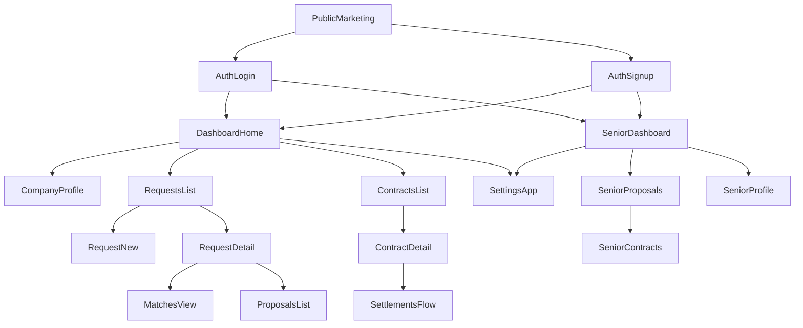

# Seniorlink Web — 정보 구조(IA)

> **버전**: 0.5 · **대상**: Next.js App Router 기반 **기업·시니어 공용 웹**  
> **연계**: [prd.md](./prd.md) · [design/DESIGN.md](./design/DESIGN.md) · [refs/seniorlink-phase1-implementation-plan.md](./refs/seniorlink-phase1-implementation-plan.md) · [stack-next-supabase.md](./stack-next-supabase.md)

---

## 1. 목적

**기업** 담당자는 로그인 이후 **TF 요청 → 매칭 → 제안 → 계약 → 정산**으로, **시니어** 전문가는 **받은 제안 → 응답(수락/거절) → 계약 조회**로 끊기지 않고 이동할 수 있도록 화면 계층·URL·내비게이션·역할 정책을 정의합니다. 모바일 앱은 별도 프로젝트로 두고, **본 웹에서 양쪽 역할을 모두 처리**합니다. 시각·레이아웃은 [design/DESIGN.md](./design/DESIGN.md)의 **Distinguished Experience**·그리드·여백 규칙을 공유합니다.

---

## 2. 디자인 시스템과의 정렬

| IA 요소 | DESIGN.md 준수 |
|---------|------------------|
| **앱 셸** | 배경 `background` / 콘텐츠 카드 `surface-container-lowest`; 사이드바는 `primary` 또는 `surface-container-high` 톤으로 구조화 |
| **글로벌 내비** | `container-max` 1280px 내 좌측 랙 + 우측 콘텐츠; 거터 **24px** |
| **목록 화면** | TF 요청·매칭·제안·계약 목록은 “목록” 절 — 행 간 여유 **24px**, 구분선은 `outline-variant` 계열 |
| **폼·마법사** | TF 요청 작성 등 다단계는 카드 **16px** 모서리·**32px** 패딩; 필드 포커스 **2px Navy** |
| **강조 CTA** | “제안 발송”“정산 승인” 등 결정적 액션은 **Warm Gold** CTA 버튼 규칙(Navy 텍스트) |
| **모달·오버레이** | 입체감 **레벨 3** — 고대비 오버레이 + 깊은 그림자 |
| **빈 상태** | Soft off-white 배경 위 카드(레벨 1); CTA는 Primary 또는 Secondary(CTA)로 계층 구분 |

---

## 3. 정보 구조 (개념도)

---

## 4. URL 라우팅 (권장)

[refs/seniorlink-phase1-implementation-plan.md](./refs/seniorlink-phase1-implementation-plan.md)의 웹 스니펫(`dashboard`, `requests`, `contracts`)과 맞춘 예시입니다. **이 저장소**에서는 `src/app/` 트리에 1:1 대응시키면 됩니다.

### 4.1 인증 경로 (스택별)

| 경로 | Nest REST + JWT | Next.js + Supabase ([stack-next-supabase.md](./stack-next-supabase.md)) |
|------|-----------------|---------------------------------------------------------------------------|
| `/login` | 이메일·비밀번호 폼 → API 로그인 | `signInWithPassword` 등 **커스텀 폼** 또는 Hosted UI로 연결 |
| `/signup` | 역할 선택 가능한 회원가입 API | `auth.signUp` + `raw_user_meta_data.role` → 트리거로 `profiles`·(`companies` 또는 `senior_profiles.profile_id`) |
| (선택) `/auth/callback` | 없음 | OAuth·매직링크 **코드 교환** 시 Route Handler에서 처리 권장 |

매직링크 전용 플로를 쓰면 `/login` 대신 `/auth/confirm` 등 별도 경로를 IA에 추가합니다.

| 경로 | 설명 |
|------|------|
| `/` | 랜딩·소개(비로그인) |
| `/login` | 로그인 |
| `/signup` | 회원가입(기본: 기업, 쿼리 `?role=senior` 시 시니어) |
| `/dashboard` | 기업 대시보드 홈(요약) |
| `/company/profile` | 기업 프로필 등록·편집 |
| `/requests` | TF 요청 목록 |
| `/requests/new` | TF 요청 생성 |
| `/requests/[requestId]` | 요청 상세 |
| `/requests/[requestId]/matches` | AI 매칭 결과 |
| `/requests/[requestId]/proposals` | 해당 요청의 제안 목록·발송 |
| `/contracts` | 계약 목록 |
| `/contracts/[contractId]` | 계약 상세·진행·PDF |
| `/contracts/[contractId]/settlement` | 정산 조회·액션 |
| `/settings` | 기업 계정·알림·조직 정보(확장) |

### 4.2 시니어 전용 경로 (`profiles.role = senior`)

| 경로 | 설명 |
|------|------|
| `/senior/dashboard` | 시니어 홈(제안·계약 건수 요약) |
| `/senior/proposals` | 받은 제안 목록·필터 |
| `/senior/proposals/[proposalId]` | 제안 상세·수락/거절 |
| `/senior/contracts` | 본인 제안과 연결된 계약 목록(조회) |
| `/senior/profile` | `senior_profiles` 편집(표시명·분야 등) |
| `/senior/settings` | 시니어 계정 설정·로그아웃 |

기업 전역 제안 목록이 필요하면 `/proposals`를 추가할 수 있습니다(선택).

---

## 5. 내비게이션

- **기업 셸**: 데스크톱 기준 **좌측 사이드바**에 `대시보드`, `기업 프로필`, `TF 요청`, `계약`, `설정` 고정. 상단 **앱 바**에 “기업 대시보드”·이메일·로그아웃.
- **시니어 셸**: 동일 **Distinguished Experience** 토큰으로 좌측에 `대시보드`, `받은 제안`, `계약`, `내 프로필`, `설정`. 상단에 “시니어 워크스페이스”.
- **컨텍스트**: 기업 요청 상세 하위에 탭 또는 서브내비로 `개요 | 매칭 결과 | 제안`.
- **브레드크럼**: 3단계 이상 깊은 화면에서만 표시. 본문 타이포는 `headline-md`~`body-md` 위계를 따름.

---

## 6. 역할별 진입 정책

| 역할 | 정책 |
|------|------|
| `company` | §4.1 기업 라우트 전체. `/senior/*` 접근 시 `/dashboard` 등으로 되돌림(구현 가드). |
| `senior` | §4.2 시니어 라우트 전체. 기업 전용 `/requests`, `/company/*` 등 접근 시 `/senior/dashboard`로 되돌림. |
| 비로그인 | 보호 경로는 `/login` + `returnUrl` ( [stack-next-supabase.md](./stack-next-supabase.md) ) |

**Supabase 채택 시**: `company` / `senior`는 JWT 클레임이 아니라 `profiles.role`(또는 동등 컬럼)과 **RLS**로 일관 정의합니다. 미들웨어는 Supabase 세션(`@supabase/ssr` + `middleware.ts`의 `updateSession`)을 통과한 뒤, 서버에서 역할을 검사합니다([stack-next-supabase.md](./stack-next-supabase.md) 2절 ia).

---

## 7. 화면–데이터 소스 매핑

### 7.1 트랙 A — Nest REST (기본)

| 화면 | 주요 REST (`/v1`) |
|------|-------------------|
| 회원가입·로그인 | `POST /v1/auth/signup`, `POST /v1/auth/login`, `POST /v1/auth/refresh` |
| 기업 프로필 | `POST /v1/companies/profile` 등 Phase 1 companies API |
| TF 요청 CRUD | `POST /v1/requests`, 요청별 `GET`/`PATCH`(명세) |
| 매칭 결과 | `GET /v1/requests/{requestId}/matches` |
| 제안 | `POST /v1/requests/{requestId}/proposals`, `GET /v1/requests/{requestId}/proposals`, `POST /v1/proposals/{proposalId}/withdraw` |
| 계약 | `GET /v1/contracts/{contractId}`, `POST /v1/contracts/{contractId}/pdf` |
| 정산 | `POST /v1/contracts/{contractId}/settlement`, `GET /v1/contracts/{contractId}/settlement`, `POST /v1/settlements/{settlementId}/release` |

전체 엔드포인트는 [refs/seniorlink-user-guide.md](./refs/seniorlink-user-guide.md) 및 Phase 1 명세를 따릅니다.

### 7.2 트랙 B — Supabase ([stack-next-supabase.md](./stack-next-supabase.md))

테이블명은 예시이며, 마이그레이션 확정 후 [prd.md](./prd.md) 8b절과 맞출 것.

| 화면 | 데이터 소스 (예시) |
|------|---------------------|
| 회원가입·로그인 | `supabase.auth.signUp` / `signInWithPassword` · 세션 쿠키(`@supabase/ssr`) |
| 기업 프로필 | `from('companies').upsert/select` (RLS: `auth.uid()` 소속 기업만) |
| TF 요청 CRUD | `from('tf_requests').insert/select/update` |
| 매칭 결과 | `from('request_matches').select` 또는 `rpc('get_matches', { request_id })` · **하이브리드** 시 Nest `GET .../matches` 결과를 동기화한 테이블 읽기 |
| 제안 | `from('proposals').insert/select` · 철회는 `update` 상태 또는 `rpc` · 시니어는 **본인 `senior_id` 행**만 `select/update` (RLS, [db-rls.md](./db-rls.md)) |
| 계약 | `from('contracts').select` · PDF는 Storage 업로드 + Edge 또는 기존 API · 시니어는 제안 체인으로 **조회만** 우선 |
| 정산 | `from('settlements')` + **웹훅**은 Route Handler / Edge에서 서명 검증 후 `update` ([stack-next-supabase.md](./stack-next-supabase.md) 3절) · 시니어 조회 정책은 [db-rls.md](./db-rls.md) |

클라이언트는 **RLS 통과 쿼리**만; `service_role`은 서버·Edge에서만 사용합니다.

---

## 8. 빈 상태·에러 동선

| 상황 | 동작 |
|------|------|
| 목록 0건 | 빈 일러스트·CTA(예: “첫 TF 요청 만들기”) — 카드 레벨 1, CTA는 디자인 시스템 CTA 규칙 |
| `401` / 세션 만료 | Nest: 리프레시 실패 시 로그인으로 이동. Supabase: `middleware`에서 세션 갱신 실패 시 동일 |
| `403` | 권한 없음 안내(역할 가드·RLS 거절) |
| `404` | 요청·계약 ID 무효 시 목록으로 링크 제공 |
| API·PostgREST 장애 | 재시도·고객센터 안내 배너(`error-container` 톤 선택 가능) |

---

## 9. 변경 이력

| 날짜 | 버전 | 내용 |
|------|------|------|
| 2026-05-14 | 0.1 | 최초 작성 |
| 2026-05-14 | 0.2 | `design/DESIGN.md` 정렬 절 추가, refs 경로 반영 |
| 2026-05-14 | 0.3 | `stack-next-supabase.md` 연계 링크 |
| 2026-05-14 | 0.4 | 인증 URL 표(REST vs Supabase), 화면–데이터 소스 7.1/7.2 분리, 역할 RLS 서술 |
| 2026-05-14 | 0.5 | 시니어 웹 §4.2·쌍방 셸·Mermaid·역할 정책(웹 단일 채널), 7.2 시니어 데이터 소스 |
