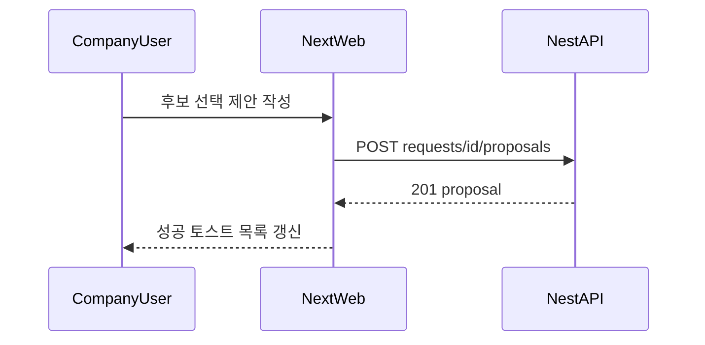
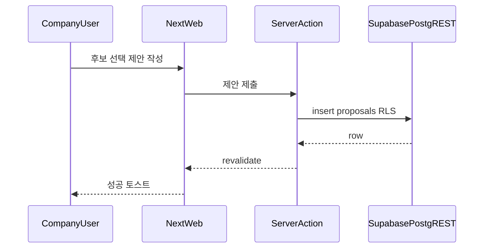

# Seniorlink Web — 유스케이스

> **버전**: 0.6 · **액터**: 기업 담당자 · 시니어 전문가(동일 웹)  
> **연계**: [prd.md](./prd.md) · [ia.md](./ia.md) · [design/DESIGN.md](./design/DESIGN.md) · [refs/seniorlink-user-guide.md](./refs/seniorlink-user-guide.md) · [stack-next-supabase.md](./stack-next-supabase.md) · **단계별 테스트**: [test_usecase.md](./test_usecase.md)

구현 스택은 [prd.md](./prd.md) 절 1을 따릅니다. 아래 표는 **동일 UC**에 대해 **Nest REST**와 **Supabase 예시**를 나란히 둡니다([stack-next-supabase.md](./stack-next-supabase.md) 2절 usecase).

---

## 1. ID 규칙

| 접두사 | 의미 |
|--------|------|
| `UC-WEB-C-xx` | Company(기업) 웹 유스케이스 |
| `UC-WEB-S-xx` | Senior(시니어) 웹 유스케이스 |

베타 시나리오 참조: [refs/seniorlink-beta-test-scenarios.md](./refs/seniorlink-beta-test-scenarios.md)의 **시나리오 1~5**를 `BTS-01` … `BTS-05`로 표기합니다.

---

## 2. UI·경험 공통 준수 ([design/DESIGN.md](./design/DESIGN.md))

- **폼·프로필·TF 요청**(`UC-WEB-C-04`~`C-06`): 레이블 상시 표시, 포커스 2px Navy, 본문 `body-md` 이상.
- **목록·매칭**(`C-07`~`C-09`): 행 간 수직 여유 24px, 구분선으로 구획; 전문 분야는 **칩·태그**(알약형, Navy 틴트).
- **결정적 액션**(`C-08`, `C-11`): Primary(56px Navy) 또는 CTA(Warm Gold + Navy 텍스트) 규칙 적용.
- **오류·토스트**: `error` / `error-container` 톤과 조합해 색만으로 상태를 전달하지 않음.

---

## 3. 유스케이스 목록 (Nest REST · Supabase 병기)

| ID | 액터 | 목표 | 전제 | 주 행위(웹) | Nest REST (참조) | Supabase 예시 ([stack-next-supabase.md](./stack-next-supabase.md)) | 사후 조건 | 예외 |
|----|------|------|------|-------------|-------------------|----------------------------------------------------------------------|-----------|------|
| UC-WEB-C-01 | 기업 | 계정 생성 | 이메일 미가입 | `/signup`(기업) 폼 제출 | `POST /v1/auth/signup` | `auth.signUp` + `profiles`에 `role=company` | 로그인 가능 | 중복 이메일 |
| UC-WEB-C-01b | 시니어 | 계정 생성 | 이메일 미가입 | `/signup?role=senior` 폼 제출 | (동일 signup API) | `auth.signUp` + `profiles`에 `role=senior` + `senior_profiles` | 로그인 가능 | 중복 이메일 |
| UC-WEB-C-02 | 기업 | 세션 확보 | 가입 완료 또는 기존 계정 | 이메일·비밀번호 입력 | `POST /v1/auth/login` | `signInWithPassword` · 세션 쿠키 | 세션 유효 | 자격 증명 오류 |
| UC-WEB-C-03 | 기업 | 세션 갱신 | 리프레시/세션 유효 | (자동) 갱신 | `POST /v1/auth/refresh` | `middleware` `updateSession` | 세션 연장 | 만료 시 재로그인 |
| UC-WEB-C-04 | 기업 | 기업 정보 등록 | 로그인됨 | 프로필 폼 | `POST /v1/companies/profile` | `from('companies').upsert` | 프로필 존재 | 검증·RLS 오류 |
| UC-WEB-C-05 | 기업 | TF 요청 등록 | 정책상 프로필 완료 등 | 요청 폼 | `POST /v1/requests` | `from('tf_requests').insert` | 요청 ID 생성 | 필수 필드 누락 |
| UC-WEB-C-06 | 기업 | TF 요청 조회·수정 | 소유권 | 목록·상세·편집 | `GET`/`PATCH` requests | `select` / `update` + RLS | 최신 반영 | 403 |
| UC-WEB-C-07 | 기업 | AI 매칭 결과 검토 | 요청 존재 | 매칭 목록 | `GET /v1/requests/{id}/matches` | `rpc('populate_request_matches', { request_id })` 후 `select` | 제안 대상 선정 가능 | 후보 0명 |
| UC-WEB-C-08 | 기업 | 제안 발송 | 후보 선택 | 제안 작성·발송 | `POST /v1/requests/{id}/proposals` | `from('proposals').insert` 또는 `rpc` | 제안 생성 | 정책 위반 |
| UC-WEB-C-09 | 기업 | 제안 목록·철회 | 제안 존재 | 목록·철회 | `GET .../proposals`, `POST .../withdraw` | `select` / `update` 상태 | 상태 갱신 | 이미 응답됨 |
| UC-WEB-C-10 | 기업 | 계약 조회 | 계약 존재 | 상세·PDF | `GET`/`POST .../pdf` | `from('contracts').select()` + `generateContractPdf` Server Action + Storage 업로드 | 문서 확보 | 무효 ID |
| UC-WEB-C-11 | 기업 | 진행·정산 | 계약 활성 | 정산 UI | settlement REST | `from('settlements')` + 웹훅 Handler | 정산 반영 | 결제 오류 |
| UC-WEB-C-12 | 기업 | 리뷰 작성 | 완료 조건 | 폼 제출 | `POST /v1/contracts/{id}/review` | `from('reviews').insert` | 리뷰 저장 | 중복 리뷰 |
| UC-WEB-S-01 | 시니어 | 프로필 유지 | 로그인됨 | `/senior/profile` 편집 | (동일 도메인 REST 가정 시 프로필 API) | `from('senior_profiles').update` + RLS `profile_id` | 저장 반영 | 검증·RLS |
| UC-WEB-S-02 | 시니어 | 제안 수신·조회 | 매칭·제안 존재 | `/senior/proposals` | `GET .../proposals` | `from('proposals').select` + `tf_requests` | 목록 표시 | 권한 없음 |
| UC-WEB-S-03 | 시니어 | 제안 응답 | `pending` 제안 | 상세에서 수락/거절 | `PATCH .../proposals` | `from('proposals').update` 상태 | `accepted`/`rejected` | 이미 종료됨 |
| UC-WEB-S-04 | 시니어 | 계약·정산 조회 | 수락된 제안 | `/senior/contracts` 등 | `GET /v1/contracts` | `from('contracts')` / `settlements` RLS | 진행 확인 | 무효 ID |

**하이브리드(A)**: 인증·프로필은 Supabase 열, 매칭·제안·계약 일부는 Nest 열만 사용할 수 있습니다. 표는 구현 시 한 열만 채워도 됩니다.

---

## 4. 베타 시나리오 매핑

| 베타 ID | 시나리오 개요 | 관련 UC |
|---------|----------------|---------|
| BTS-01 | 기본 프로필·TF 요청 등록 | UC-WEB-C-04, C-05 |
| BTS-02 | AI 매칭·제안 발송 | UC-WEB-C-07, C-08, C-09 |
| BTS-03 | 제안-수락-계약 | UC-WEB-C-09, C-10, **UC-WEB-S-03**, **UC-WEB-S-04** |
| BTS-04 | 진행·정산 | UC-WEB-C-11 |
| BTS-05 | 종합 피드백 | (비기능·설문, 웹은 링크/배너 수준) |

---

## 5. 시퀀스: 제안 발송

### 5.1 Nest REST

### 5.2 Supabase ([stack-next-supabase.md](./stack-next-supabase.md))

---

## 6. 시니어 웹 UC 요약

`UC-WEB-S-01`~`S-04`는 [ia.md](./ia.md) §4.2 경로와 [db-rls.md](./db-rls.md)의 시니어용 RLS와 대응합니다. 상세 절차는 [test_usecase.md](./test_usecase.md)의 시니어 절을 따릅니다.

---

## 7. 변경 이력

| 날짜 | 버전 | 내용 |
|------|------|------|
| 2026-05-14 | 0.1 | 최초 작성 |
| 2026-05-14 | 0.2 | `design/DESIGN.md` UI 준수 절 추가, refs 링크로 정리 |
| 2026-05-14 | 0.3 | Supabase 스택 시 API 열 치환 안내·`stack-next-supabase.md` 링크 |
| 2026-05-14 | 0.4 | `stack-next-supabase.md` 반영: Nest·Supabase 병기 표, 시퀀스 5.1/5.2 |
| 2026-05-14 | 0.5 | 헤더에 [test_usecase.md](./test_usecase.md) 링크 추가 |
| 2026-05-14 | 0.6 | 시니어 웹 1차: `UC-WEB-S-01`~`S-04` 표·BTS-03·§6 |
| 2026-06-07 | 0.7 | Phase 6 구현 반영: PDF 생성(UC-WEB-C-10 `generateContractPdf` + Storage), 정산(UC-WEB-C-11), 웹훅 핸들러. AI 매칭 RPC(UC-WEB-C-07). |
